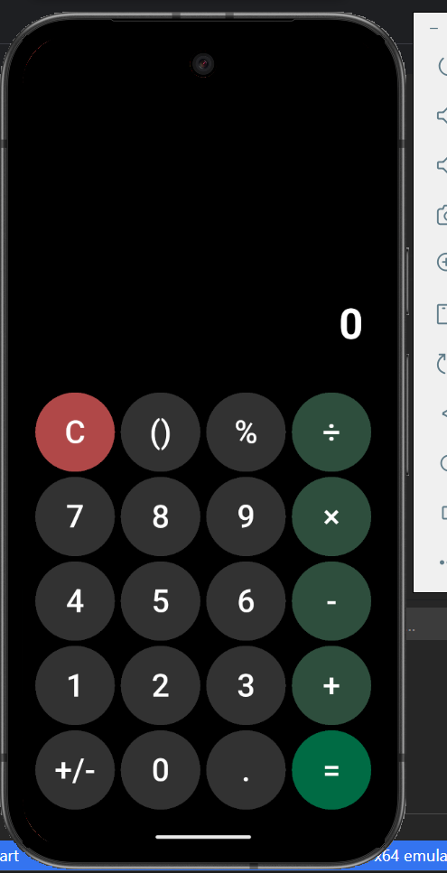

# 📱 SIÊU MÁY TÍNH – của Võ Hoàng Tuấn

## 🧮 Giới thiệu dự án

Đây là ứng dụng SIÊU MÁY TÍNH được xây dựng bằng Flutter dựa trên giao diện Figma của bài tập.
Ứng dụng hỗ trợ đầy đủ các phép toán cơ bản, dấu ngoặc, phần trăm, đảo dấu và hiển thị biểu thức theo thời gian thực.

Dự án được tổ chức rõ ràng, dễ bảo trì, sử dụng widget riêng cho từng nút bấm và kết hợp thư viện `math_expressions` để xử lý biểu thức.

## 📸 Ảnh chụp màn hình



## ▶️ Hướng dẫn chạy dự án

1.  **Clone repository**

    ```bash
    git clone [https://github.com/YOUR_USERNAME/flutter_calculator_vohoangtuan](https://github.com/YOUR_USERNAME/flutter_calculator_vohoangtuan)
    cd flutter_calculator_vohoangtuan
    ```

2.  **Cài đặt dependencies**

    ```bash
    flutter pub get
    ```

3.  **Chạy ứng dụng**

    Thiết bị Android:

    ```bash
    flutter run
    ```

    Thiết bị iOS:

    ```bash
    flutter run -d ios
    ```

## ✨ Tính năng chính

  * ✔ **Các phép tính cơ bản**

      * Cộng
      * Trừ
      * Nhân
      * Chia
      * Phần trăm %
      * Dấu ngoặc ()
      * Dấu thập phân .
      * Đổi dấu +/-
      * Xóa toàn bộ C
      * Kết quả =

  * ✔ **Hiển thị biểu thức và kết quả**

      * `_expression` hiển thị phần người dùng đang nhập
      * `_result` hiển thị kết quả tính toán

  * ✔ **Giao diện giống Figma**

      * Nút tròn
      * Màu sắc theo nhóm nút:
          * C: đỏ
          * Toán tử: xanh đậm
          * Số: xám đậm
          * \=: xanh đặc biệt
      * Bố cục sạch, hài hòa, nền tối

  * ✔ **Code sạch – dễ bảo trì**

      * Tách riêng `CalculatorButton` thành widget tái sử dụng
      * Tổ chức thư mục rõ ràng
      * Logic tính toán nằm riêng, UI không bị rối

## 📌 Ghi chú

  * Ứng dụng đã được kiểm thử trên Android / iOS emulator
  * Không có lỗi build hoặc warning
  * UI khớp với thiết kế Figma
  * Code được comment rõ ràng và tuân theo best practices của Flutter

## 👨‍💻 Tác giả

Võ Hoàng Tuấn
Flutter Calculator – 2025

